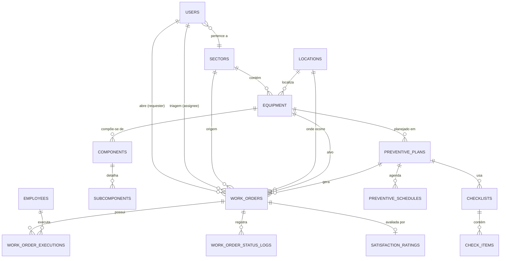
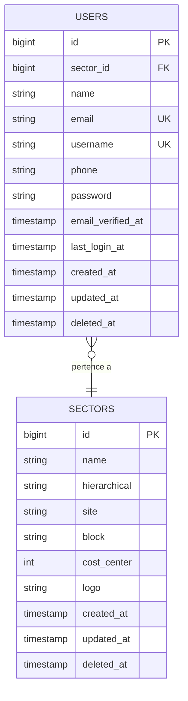
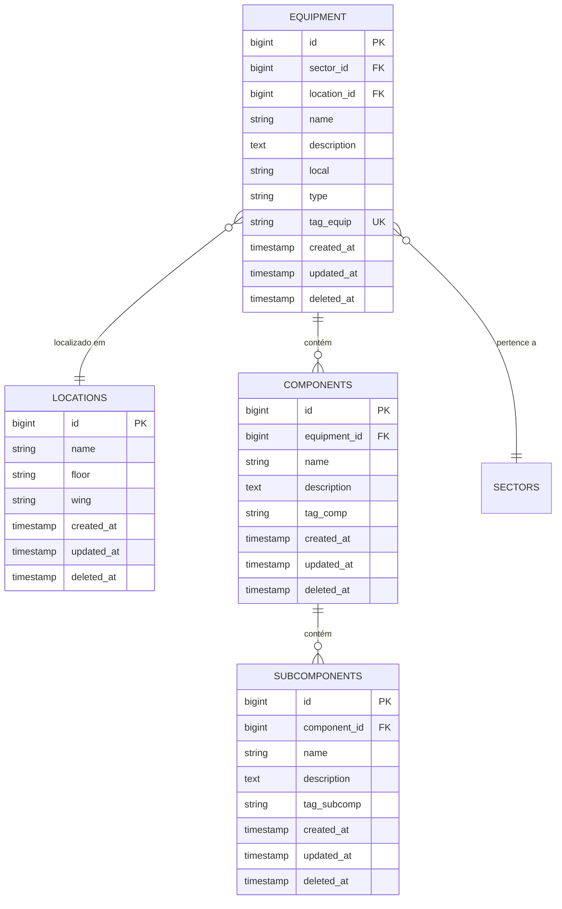
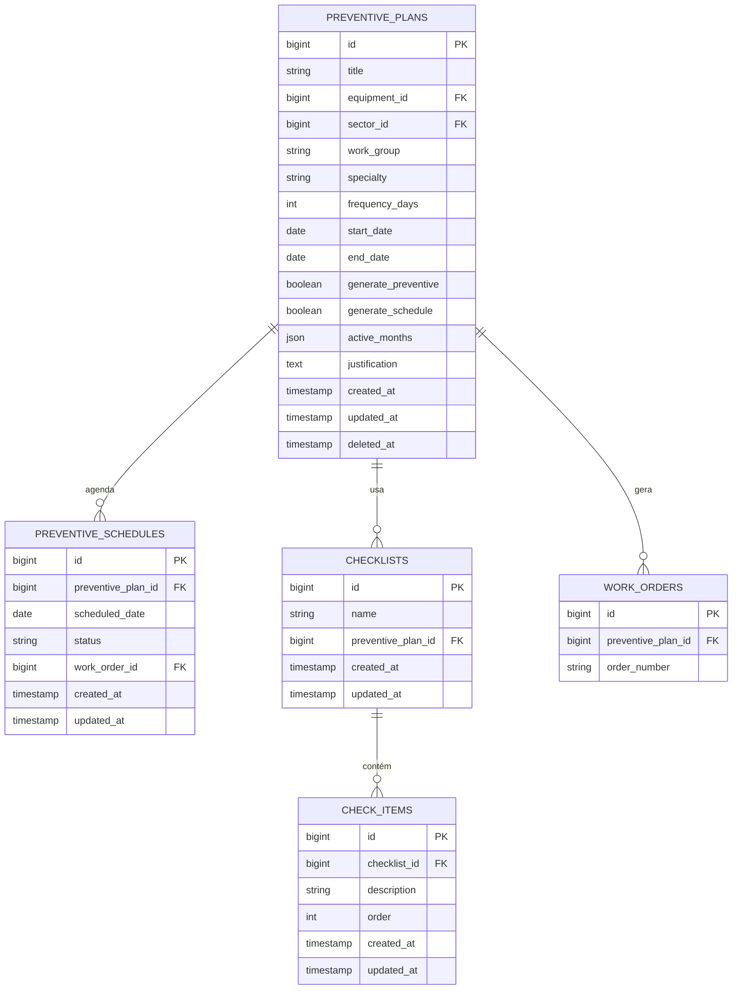
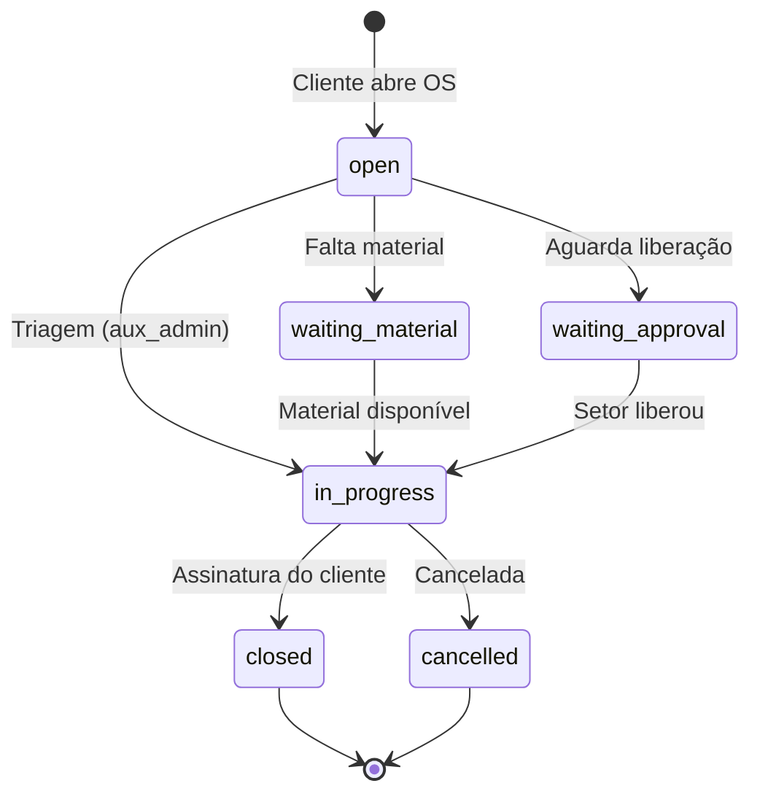

# Mamut — Modelo Entidade-Relacionamento (ER)
### Módulo: Gestão de Manutenção de Ativos e Predial

> Diagramas em **Mermaid** (renderizam nativamente no GitHub/GitLab e em extensões do VS Code).
> Tabelas e campos em **inglês**; descrições em **português (pt-BR)**.

---

## 1. Visão Geral (Alto Nível)



---

## 2. Detalhamento por Domínio

### 2.1 Domínio: Usuários e Setores



**Descrição**:
- `users`: mantém dados de autenticação e vínculo com setor.
- `sectors`: cadastro de setores (hierarquia, site, bloco, centro de custo).
- Roles são gerenciadas pela tabela `model_has_roles` (spatie/laravel-permission).

---

### 2.2 Domínio: Ativos (Equipamentos)



**Descrição**:
- Hierarquia de ativos: `equipment → components → subcomponents`.
- `tag_equip` deve ser único quando não nulo (patrimônio).

---

### 2.3 Domínio: Ordens de Serviço (Coração do Sistema)

```mermaid
erDiagram
    WORK_ORDERS {
        bigint id PK
        string order_number UK
        string type
        string status
        string priority
        string work_group
        string specialty
        bigint sector_id FK
        bigint location_id FK
        bigint equipment_id FK
        bigint component_id FK
        bigint subcomponent_id FK
        bigint user_id FK
        bigint assigned_to FK
        string title
        text description
        text solution
        string customer_signature_path
        string supervisor_signature_path
        boolean is_stopped
        timestamp opened_at
        timestamp first_response_at
        timestamp closed_at
        bigint preventive_plan_id FK
        boolean automatic_created
        timestamp created_at
        timestamp updated_at
        timestamp deleted_at
    }

    WORK_ORDER_EXECUTIONS {
        bigint id PK
        bigint work_order_id FK
        bigint maintainer_id FK
        string specialty
        timestamp started_at
        timestamp finished_at
        int duration_minutes
        text observations
        timestamp created_at
        timestamp updated_at
    }

    WORK_ORDER_STATUS_LOGS {
        bigint id PK
        bigint work_order_id FK
        bigint user_id FK
        string from_status
        string to_status
        text notes
        timestamp created_at
        timestamp updated_at
    }

    SATISFACTION_RATINGS {
        bigint id PK
        bigint work_order_id FK_UK
        string rating
        text comment
        timestamp created_at
        timestamp updated_at
    }

    EMPLOYEES {
        bigint id PK
        string drt_number UK
        string name
        string specialty
        timestamp created_at
        timestamp updated_at
        timestamp deleted_at
    }

    WORK_ORDERS ||--o{ WORK_ORDER_EXECUTIONS : "possui"
    WORK_ORDERS ||--o{ WORK_ORDER_STATUS_LOGS : "registra"
    WORK_ORDERS ||--o| SATISFACTION_RATINGS : "avaliada por"
    EMPLOYEES ||--o{ WORK_ORDER_EXECUTIONS : "executa"
```

**Descrição dos Campos-Chave**:

| Campo | Valores Possíveis | Observação |
|---|---|---|
| `type` | `corrective`, `preventive`, `predictive`, `inspection` | Discriminador principal |
| `status` | `open`, `in_progress`, `waiting_material`, `waiting_approval`, `closed`, `cancelled` | Fluxo de status |
| `priority` | `emergency`, `urgency`, `high`, `medium`, `low` | SLA calculado |
| `work_group` | `hydraulic`, `electric`, `building`, `gas_therapy`, `air_conditioning`, `gardening` | Grupo de trabalho |
| `specialty` | `electrician`, `plumber`, `building_agent`, `hvac_tech`, `carpenter`, `gardener`, `supervisor` | Especialidade |

`customer_signature_path` e `supervisor_signature_path` guardam caminhos relativos para arquivos em storage privado. As imagens não são armazenadas como Base64 no banco.

**Regras de Negócio**:
1. `order_number` é gerado automaticamente (`OS-YYYYMMDD-NNNN` para corretivas; `PM-YYYYMMDD-NNNN` para preventivas).
2. Encerramento de OS corretiva exige assinatura do cliente; demais, do supervisor.
3. Um `satisfaction_rating` só é criado para OS do tipo `corrective`. Se não avaliada em X dias, assume `satisfied`.

---

### 2.4 Domínio: Manutenção Preventiva / Preditiva / Inspeção



**Descrição**:
- `preventive_plans`: define periodicidade e quais meses do ano gerar.
- `preventive_schedules`: registra cada execução planejada; ao gerar a OS, vincula `work_order_id`.
- `active_months`: array JSON `[1..12]` com os meses ativos.
- Unicidade `(preventive_plan_id, scheduled_date)` impede duplicação.

---

## 3. Dicionário de Dados (Resumo)

| Tabela | Descrição | Linhas esperadas |
|---|---|---|
| `users` | Usuários autenticáveis | Baixo (< 500) |
| `sectors` | Setores/departamentos | Baixo (< 100) |
| `locations` | Locais físicos | Médio (100–1.000) |
| `equipment` | Ativos patrimoniais | Médio (1.000–50.000) |
| `components` | Componentes do ativo | Médio |
| `subcomponents` | Subcomponentes | Alto |
| `employees` | Mantenedores (não logam) | Baixo (< 200) |
| `work_orders` | OS (todas as modalidades) | Alto (crescimento contínuo) |
| `work_order_executions` | Histórico de execução por mantenedor | Alto |
| `work_order_status_logs` | Auditoria de status | Alto |
| `satisfaction_ratings` | Avaliações de OS corretivas | Médio |
| `preventive_plans` | Planos de manutenção | Baixo |
| `preventive_schedules` | Cronograma anual gerado | Médio |
| `checklists` / `check_items` | Verificações preventivas | Médio |

---

## 4. Índices Recomendados

```sql
-- work_orders: consultas mais frequentes
CREATE INDEX idx_work_orders_status ON work_orders(status);
CREATE INDEX idx_work_orders_type ON work_orders(type);
CREATE INDEX idx_work_orders_priority ON work_orders(priority);
CREATE INDEX idx_work_orders_opened_at ON work_orders(opened_at);
CREATE INDEX idx_work_orders_status_type ON work_orders(status, type);

-- executions: relatórios por mantenedor
CREATE INDEX idx_executions_wo_maintainer ON work_order_executions(work_order_id, maintainer_id);

-- schedules: consulta de cronograma
CREATE INDEX idx_schedules_date ON preventive_schedules(scheduled_date);
CREATE UNIQUE INDEX uq_schedules_plan_date ON preventive_schedules(preventive_plan_id, scheduled_date);
```

---

## 5. Chaves Estrangeiras e Regras de Exclusão

| De | Para | On Delete | Justificativa |
|---|---|---|---|
| `work_orders.user_id` | `users.id` | SET NULL | Preservar histórico mesmo se usuário for removido |
| `work_orders.sector_id` | `sectors.id` | SET NULL | Setor pode ser excluído sem perder OS |
| `work_orders.equipment_id` | `equipment.id` | SET NULL | Equipamento pode ser desativado |
| `work_order_executions.work_order_id` | `work_orders.id` | CASCADE | Sem OS, execução perde sentido |
| `work_order_executions.maintainer_id` | `employees.id` | CASCADE | Mantenedor removido → remove vínculos |
| `satisfaction_ratings.work_order_id` | `work_orders.id` | CASCADE | Avaliação pertence a OS |
| `preventive_schedules.preventive_plan_id` | `preventive_plans.id` | CASCADE | Cronograma pertence ao plano |

---

## 6. Fluxo de Status (Diagrama de Estados)



**Regras**:
- `open → in_progress` é feito pela triagem.
- `waiting_material` e `waiting_approval` são estados intermediários (bloqueios).
- `closed` só é permitido com assinatura do cliente (corretiva) ou supervisor (preventiva/preditiva/inspeção).
- Toda transição gera registro em `work_order_status_logs`.

---

## 7. Modelo Lógico Final (Resumido)

```
users ──────┐
             ├──> work_orders <──┐
sectors ─────┤        │          │
locations ───┤        │          │
equipment ───┘        │          │
                      ├──> work_order_executions <── employees
                      ├──> work_order_status_logs
                      ├──> satisfaction_ratings
                      │
preventive_plans ─────┼──> preventive_schedules ──> work_orders
                      │
                      └──> checklists ──> check_items
```

---

## 8. Notas de Evolução

Ao expandir para **Módulo de Materiais**:

- Adicionar `materials`, `stock_movements`, `material_requests`.
- Relacionar `material_requests.work_order_id` (consumo por OS).

Ao expandir para **Módulo de Utilidades**:

- Adicionar `utility_meters`, `utility_readings`, `utility_consumption`.
- Relacionar `utility_readings.sector_id` (consumo por setor).